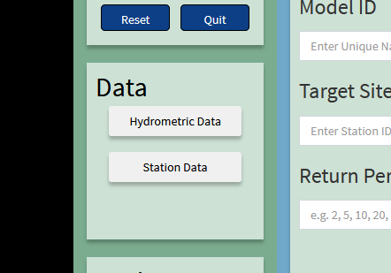

```{r setup, include=FALSE}
knitr::opts_chunk$set(echo = FALSE)
```

# Introduction

## Objective

- The purpose of this presentation is to guide the user throught the common steps of using the Graphical User Interface (GUI) of the `floodnetRfa` package.

- Compare to the terminal interface, the resulting analysis follows more stricly the Floodnet guidelines.

- The GUI focus on at-site and regional flood frequency analysis of hydrometric gauged stations.

## Main Screens

First, let's have a quick look at the two mean screen:

## Main Screens

Model: Used for fitting and managing models.


## Main Screens

Resutls: Used to visualized and export model results.


## Table of contents

In the rest of the presentation, we will discuss the following points:

- Guidelines summaries

- Data Input

- Fitting models

- Managing models

- Visualizing models

- Exporting results

# Guidelines summaries

## Annual maximum discharge (AMAX)

- The simplest approach to the frequency analysis of extremes, like floods, is to fit a distribution on the sample of annual maxima. 

- The distribution can be selected manually or automatically according to the Akaiky Information Criteria (AIC)

- Estimation is done using the method of linear moments (L-moments).

- Dispersion and confidence intervals are evaluated using parametric bootstrap.

## Peaks over threshold (POT)

- A second approach consists to model the peaks above a given threshold using a Generalized Pareto distribution (GPA) with 2 parameters. 

- Exceedances are extracted using the declustering method presented by [Lang _et al._ 1999](https://doi.org/10.1016/S0022-1694(99)00167-5)

- Estimation is done using the method of maximum likelihood.

- Dispersion and confidence intervals are evaluated using parametric bootstrap.
	
## Regional Frequency analysis

- Regional estimates are obtained by the Index-flood model using sample mean as scaling factor.

- Estimation is done using the L-moment algorithm introduced by [Hosking and Wallis, 1997](https://www.cambridge.org/core/books/regional-frequency-analysis/8C59835F9361705DAAE1ADFDEA7ECD30#)

- Homogenous regions are formed using pooling groups according to the floodnet guidelines. See [Mostofi and Burn, 2019](https://doi.org/10.1080/07011784.2018.1548946)

- Dispersion and confidence intervals are evaluated using parametric bootstrap.
	
	
# Data Input

## Source of information

- The GUI accept two sources of data
	- Hydrometric data that containing streamflow data.
	- Station data that are general information about stations and their basins.
	
-  Hydrometric data
	- The input file is either a CSV file or a locall HYDAT database (sqlite3)
	- The CSV file has 3 columns: Station, Date, Value.
	- Station is a unique identifiant (alphanumeric).
	- The date must be in a valid format (e.g. `'2020-07-15'`)
	- Depending on the analysis, the values can be annual maxima or daily discharges.
	

## Source of information

- Station data are meta information about stations.
	- Needed only for Reginal Frequency Analysis (RFA)
	- The input must be a CSV file.
	- Each row represent a station with multiple attributes in column.

- List of attributes
	- Station ID. Same as in hydrometric data
	- Drainage area in  $km^2$.
	- Mean annual precipitation (MAP) in $mm$.
	- Super Region.
	- Threshold (only for RFA POT)
	
## Data Panel

Use the two buttons to select data input. 



## Data Panel

A explorer windows will appear. Select the desired file.


## Data Panel

When the file is selected the name appears below the button.


# Fitting models

## Model Configuration

The model configuration panel is used to configure the desired model. 
Once configured, press the `Fit` button. 


## Model Configuration

- Model ID: Identifiant of the model. Must be unique and meaningful.

- Method: Method use to perform the frequency analysis.

- Target Site: Station of interest. Must correspond to the ID of one hydrometric station.

- Return period: List of return periods separated by a comma, and for which flood quantiles will be evaluated.

## Model Configuration (AMAX)

- For an AMAX analysis the distribution must be selected.

- There are four distribution choices: 
  - Generalized Extreme Values(GEV)
  - Generalized Logistic (GLO)
  - Generalized Normal (GNO)
  - Pearson type III (PE3)

- A best distribution can be automatically selected using AIC.

## Model Configuration (AMAX)

Select the distribution using the drop-down list


## Model Configuration (POT)

No distribution is selected for POT. However, a threshold must be passed manually or automatically according to the procedure developed by [Durocher _et al._, 2018](https://onlinelibrary.wiley.com/doi/abs/10.1002/hyp.13223)


## Model Configuration (RFA)

For RFA the user must select a `Super Regions`. 
It corresponds to a column of the station data that classified all stations. 
Only the stations inside the same super region as the target site are considered for forming the pooling groups. 


## Options

An Options Panel is available to better control the results of the fitted models.


## Options

- Confidence Level: Control the probability coverage of the confidence intervals.
- Simulations: Size of bootstrap sample.
- Heterogeneity: Threshold for the measure of heterogeneity to classify a pooling group as an homogenous region.
- Pooling group: Initial size of the pooling group.
- Intersite Correlation: Coefficient of correlation used for the regional bootstrap sample.
- Graphical Theme: Style of the ouput graphics.

## Return level Plot

After pressing the `Fit` button, the graphics of the flood quantiles (Return Levels) with respect of the return period is produced for assessing the quality of the fitted model. 


## Flood quantile

The flood quantiles are also presented in the form of a table.


## Flood quantile

The standard error (se) and the confidence intervals (lower, upper) are also available.


# Model management

## Fitted Models

After pressing the `Fit` button, the fitted model is added to a list, where 
each entry is identified by the `Model ID`.


## Fitted Models
 
- One or more model can be selected by clicking the list.
- Selected models can be removed from the list using the `Remove` button.
- Further results are presented by clicking on the `Show` button.
- When multiple models are selected, comparison graphics are produced.

## Saving models

- A list of fitted models can be saved using the `Save` buttons.
- A file explorer will open and allow you to select where to save the models
- The saved models are saved in common R format: `.Rdata`.
- The `Open` button will load previously saved models. 
- The `Reset` button will empty the current list of model.


