```{r setup, include=FALSE}
knitr::opts_chunk$set(echo = TRUE)
```

# Introduction

## Objective

- The purpose of this presentation is to guide the user throughout the steps of using the Graphical User Interface (GUI) of the R package `floodnetRfa`.

- The GUI allows performing flood frequency analysis of hydrometric stations using local and regional methods.

- Utilities for predicting flood quantiles at ungauged basins are only available from the R terminal.


## Starting the GUI

- The GUI runs inside a web browser.
- It is normally launched from the R terminal.
- A script can be used to launch the GUI from the system terminal.

```{r, eval=FALSE}
library(floodnetRfa)
FloodnetApp()

# Create a shortcut on the desktop
FloodnetApp(shortcut = "C:/Users/JohnDoe/Desktop/FloodnetApp.cmd")
```

## Table of contents

- For the rest of the presentation, we will discuss the following points.
  - Guideline summary
  - Input data
  - Configuring models
  - Managing models
  - Exporting results

# Guideline summary

## Annual maximum (AMAX)

- The principal method in flood frequency analysis consists to fit a distribution on the sample of annual maximum streamflow. 
- Estimation is performed by the method of linear moments (L-moments).

- Dispersion and confidence intervals are evaluated using parametric bootstrap.

## Peaks over threshold (POT)

- A second approach is to fit a distribution of streamflow peaks using the Generalized Pareto distribution (GPA). 

- Peaks are exceedances extracted from a declustering method based on a threshold and the basin drainage area

- Estimation is done using the method of maximum likelihood.

- Dispersion and confidence intervals are evaluated using parametric bootstrap.
	
## Regional Frequency analysis (RFA)

- RFA used the index-flood model, which assumes that all distributions inside a homogenous region are proportional.

- The sample mean is used as a scaling factor.

- Estimation is done by averaging the L-moments of the scaled sample.

- Dispersion and confidence intervals are evaluated using parametric bootstrap.

## Regional Frequency analysis (RFA)

- An homogenous region is neighborhoods (pooling group) formed around a target site.

- It used a similarity measure based on the timing and regularity of the annual maximum discharge.

- The homogeneity is assessed by a heterogeneity measure based on the Linear Coefficient of Variation (LCV).

- Heterogeneous sites are sequentially removed from an initial pooling group.

## Package documentation

For more details on the methodologies, please consult the Floodnet guideline or the documentation of the following R functions.

- `FloodnetAmax`
- `FloodnetPot`
- `FloodnetPool`
	
# Input data

## Model Screen

- This image present an overlook of the model screen that is used for configuring and managing models.

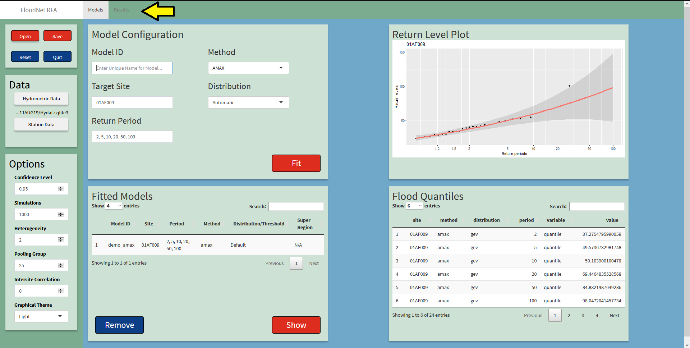


## Source of information

- The GUI may need two sources of data.
	- Hydrometric data.
	- Station data.
	
-  Hydrometric data
	- Either a CSV file or an HYDAT database (sqlite3)
	- The CSV file must have 3 columns: Station, Date, Value.
	- Station is a unique identifier (alphanumeric).
	- The date must be in a valid format, _e.g._ `'2020-07-15'`
	- Depending on the analysis, the values can be annual maxima or daily discharges.
	

## Source of information

- Station data
	- Contains meta information about the stations.
	- Must be a CSV file.
	- Each row represents a station with multiple attributes in column.

- List of attributes
	- Station ID. Same as in hydrometric data
	- Drainage area in  $km^2$.
	- Mean annual precipitation (MAP) in $mm$.
	- Super Region.
	- Threshold.
	
## Data Panel

- Use the two buttons to select the input data. 

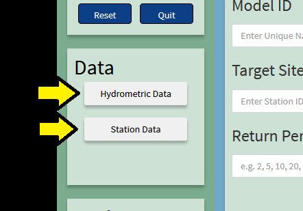

## Data Panel

- An explorer window appears.

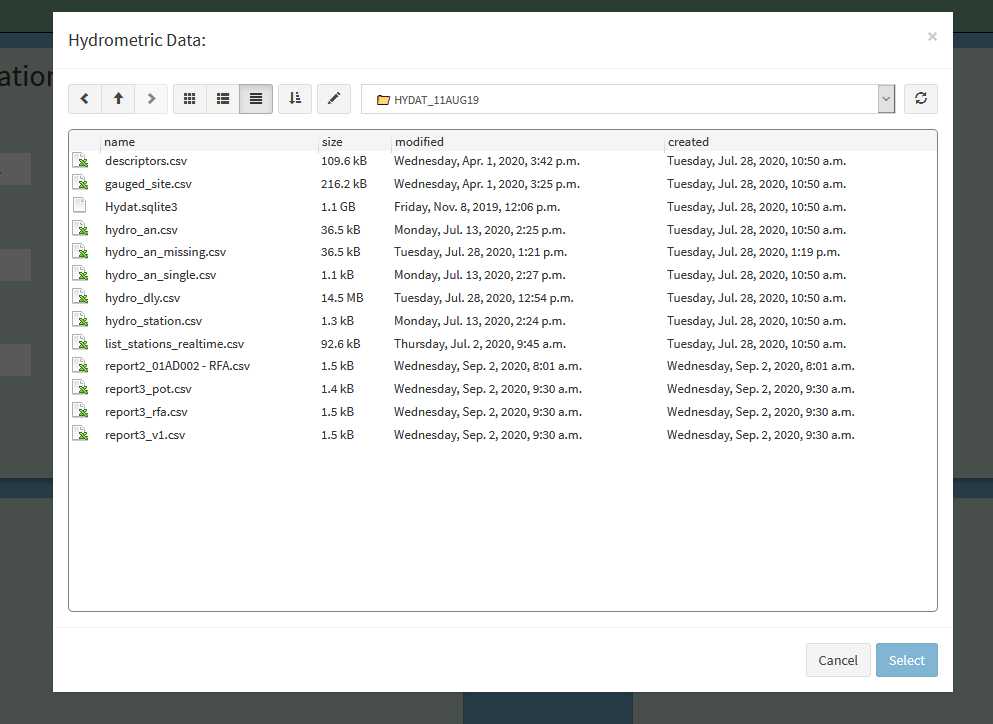

## Data Panel

- After a file is selected the name appears below.

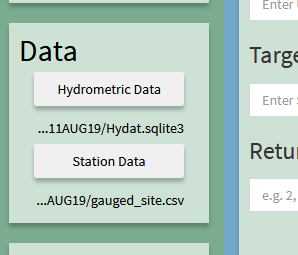

# Configuring models

## Model Configuration

The model configuration panel is used to configure the desired model. 
Once configured, press the `Fit` button. 

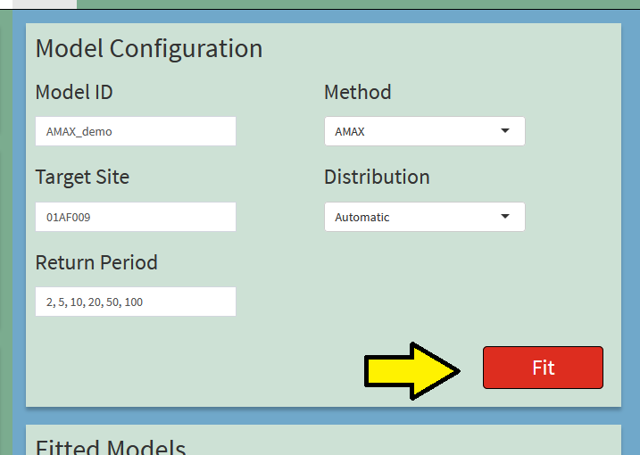

## Model Configuration

- Model ID: An identifier of the model. It must be unique and meaningful.

- Method: Method used to perform frequency analysis (_e.g._ AMAX, POT, RFA).

- Target Site: Station ID of the site of interest.

- Return period: List of return periods used to evaluate the flood quantiles. Must be separated by a comma.

## Model Configuration (AMAX)

- For AMAX, a distribution is selected among four choices: 
  - Generalized Extreme Values(GEV)
  - Generalized Logistic (GLO)
  - Generalized Normal (GNO)
  - Pearson type III (PE3)

- The best distribution can also be selected automatically using the AIC.

## Model Configuration (AMAX)

- Select the distribution using the drop-down list

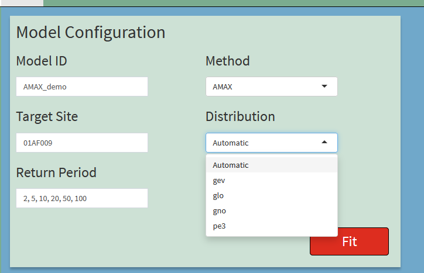

## Model Configuration (POT)

- For POT, the distribution is known but the threshold and the target drainage area must be passed. 

- The automatic procedure selects the lowest threshold that respects the modeling assumptions.

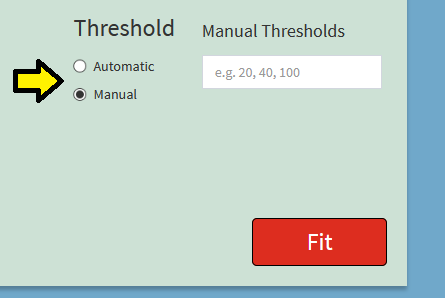

## Model Configuration (RFA)

- For RFA, the user must select a `Super Region` that identifies a class of stations similar to the target site.

- Pooling groups include only stations inside the target super region.

- The super region is associated with a column of the station data file. 

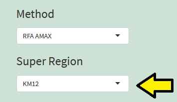

## Model Configuration (RFA POT)

- RFA can be applied to both AMAX and POT approaches.

- RFA POT requires that the threshold are known for all sites in the pooling group.

## Options

- A panel of options is available to control the fitting process.

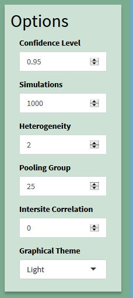

## Options

- Confidence Level: Probability coverage of the confidence intervals.
- Simulations: Size of the bootstrap samples.
- Heterogeneity: Level of heterogeneity measure above which a pooling group is considered as homogenous.
- Pooling group: Initial size of the pooling group.
- Intersite Correlation: Coefficient of correlation used to simulate a bootstrap sample with RFA.
- Graphical Theme: Style of the output graphics.

## Return level Plot

- After pressing the `Fit` button, the graphics of the return levels (flood quantiles) versus the return period is produced for assessing the quality of the fit. 

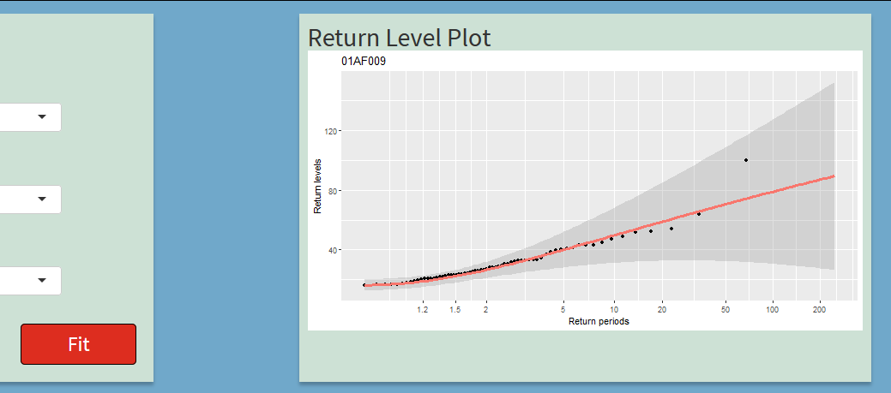

## Flood quantiles

- The flood quantiles are presented in the form of a table.

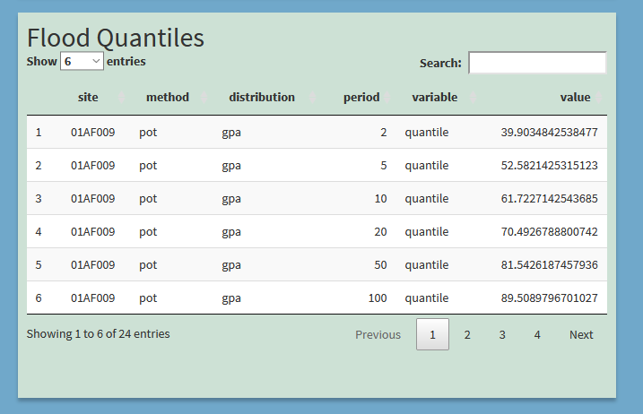

## Flood quantiles

The standard error (se) and the confidence intervals (lower, upper) are also available.

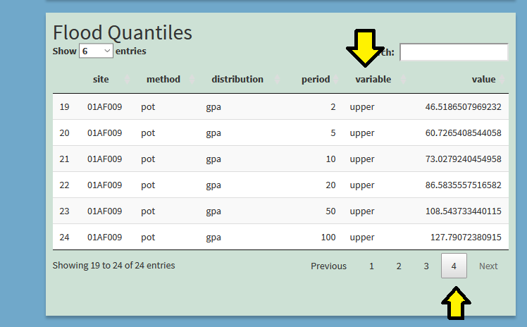

# Model management

## Fitted Models

After pressing the `Fit` button, the fitted model is added to a list, where 
each entry is identified by its `Model ID`.

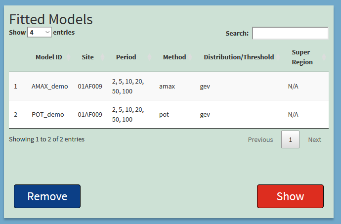

## Fitted Models
 
- One or more models can be selected by clicking the list.
- Selected models can be removed from the list by using the `Remove` button.
- Additional results can be displayed by clicking on the `Show` button.

## Saving models

- The list of fitted models can be saved using the `Save` buttons.
- A file explorer will open and allow the user to select the file name and location.
- The saved models are in an R format with extension `.Rdata`.
- The `Open` button load previously saved models. 
- The `Reset` button empties the current list of models.

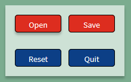

# Exporting results

## Result Screen

- Here is an overview of the result screen displayed by the `Show` button.

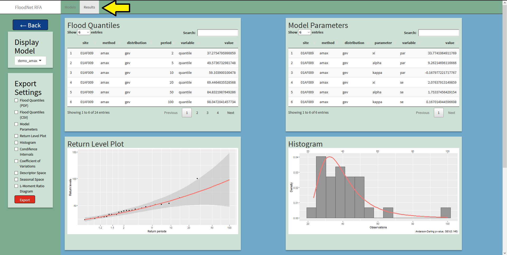

## Display model

- If multiple models were selected, the display panel allows switching between them.

- The `<-Back` button allows going back the the model screen

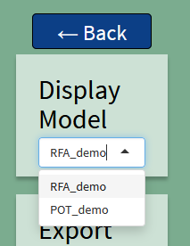

## Comparison Graphics

- Some graphics are specific to a model, some include mutiple models.

- For example, the comparison of the confidence intervals allows visualizing the difference the estimated flood quantiles and it variability.

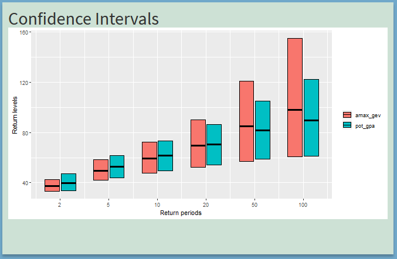

## Regional Graphics

- Some graphics provides information on the selected pooling groups.

- For example, the L-ratio diagram shows the dispersion of  3rd and 4th L-moment among the pooling group.

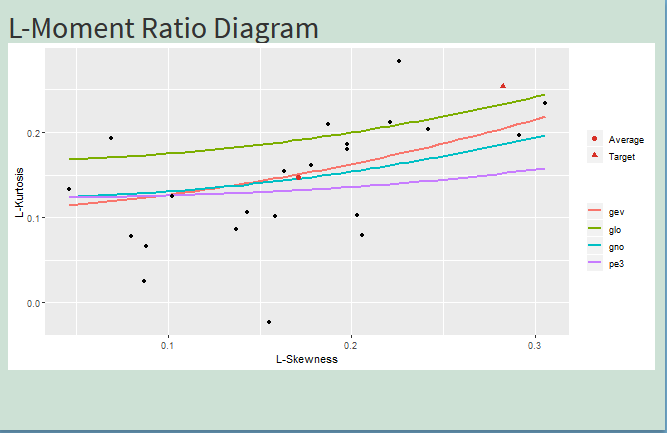

## Export 

- The `Export` button saved the element of the screen in a PDF.
- The button will open a file explorer that allows to select the file name and location.

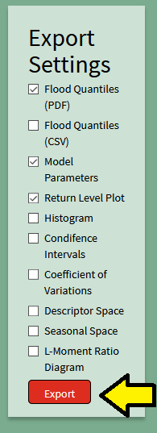

## Export 

- Specific elements of the result screen can be selected.
- The flood quantiles and the parameters can also be exported in CSV.

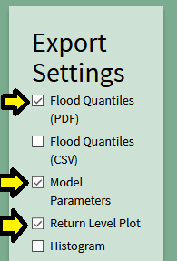

# End - Please refer to the Floodnet guideline for more details.
